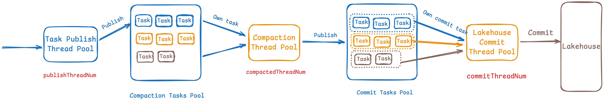

# Ursa Core

One message written into Ursa follows these steps:

- Write to the WAL storage pending queue (write buffer)
- When the write buffer is full (4MB) or meets time threshold (250ms), flush the buffer to WAL file asynchronously
- When the flush buffer callback completes, return acknowledgment to the client
- Store the message in the Write cache

## WAL Storage Metrics

| **Metric Name**                                      | **Type**     | **Description**                                                                          |
|------------------------------------------------------|--------------|------------------------------------------------------------------------------------------|
|ursa_storage_wal_putEntry_count_total            | Counter      | Total number of entries successfully written to the Write-Ahead Log (WAL).                |
|ursa_storage_wal_putEntry_rejected_count_total   | Counter      | Total number of entries rejected during attempted writes to the WAL.                      |
|ursa_storage_wal_putEntry_duration_seconds_bucket | Histogram   | Latency distribution for writing entries to the WAL (in seconds).                         |
|ursa_storage_wal_putEntry_pending_duration_seconds_bucket | Histogram | Latency distribution for entries waiting in the WAL buffer before processing (in seconds). |
|ursa_storage_wal_putEntry_cache_duration_seconds_bucket | Histogram | Latency distribution for writing entries to the WAL write cache (in seconds).             |
|ursa_storage_wal_getEntries_duration_seconds_bucket | Histogram | Latency distribution for reading multiple entries from write cache, read cache, or backend storage (in seconds). |
|ursa_storage_wal_getEntry_duration_seconds_bucket | Histogram  | Latency distribution for reading individual entries from WAL files (write/read cache or backend storage). |
|ursa_storage_wal_writeCache_flush_duration_seconds_bucket | Histogram | Latency distribution for flushing the write cache to persistent storage (in seconds).     |
|ursa_storage_wal_readCache_loading_count_total   | Counter      | Total number of read cache loads from backend storage.                                    |
|ursa_storage_wal_readCache_eviction_count_total  | Counter      | Total number of entries evicted from the read cache.                                      |
|ursa_storage_wal_readCache_loading_duration_seconds_bucket | Histogram | Latency distribution for loading WAL files from backend storage into the read cache (in seconds). |
|ursa_storage_wal_read_cache_missed_total         | Counter      | Total number of read cache misses (entries not found in either write cache or read cache). |
|ursa_storage_wal_putEntry_pending_count          | Gauge        | Current number of entries queued in the WAL pending buffer.                               |
|ursa_storage_wal_writeCache_flushCallback_pending_count | Gauge | Current number of write cache flushes awaiting acknowledgment.                           |
|ursa_storage_wal_readCache_size_bytes            | Gauge        | Current size of the read cache in bytes.                                                  |

## File Storage Metrics
| **Metric Name**                                      | **Type**     | **Description**                                                                 |
|------------------------------------------------------|--------------|---------------------------------------------------------------------------------|
| ursa_storage_backend_storage_request_total       | Counter      | Total number of operation requests to the backend storage (local file or cloud storage). |
| ursa_storage_backend_write_duration_seconds_bucket | Histogram  | Latency distribution for write operations to backend storage (in seconds).       |
| ursa_storage_backend_read_duration_seconds_bucket  | Histogram  | Latency distribution for read operations from backend storage (in seconds).      |
| ursa_storage_backend_metadata_read_duration_seconds_bucket | Histogram | Latency distribution for reading metadata from backend storage (in seconds). |
| ursa_storage_backend_crc_duration_seconds_bucket   | Histogram  | Latency distribution for Cyclic Redundancy Check (CRC) calculations in backend storage (in seconds). |
| ursa_storage_backend_delete_duration_seconds_bucket | Histogram | Latency distribution for object deletion operations in backend storage (in seconds). |
| ursa_storage_backend_write_bytes_count_bytes_total | Counter   | Total bytes written to backend storage.                                          |
| ursa_storage_backend_read_bytes_count_bytes_total  | Counter   | Total bytes read from backend storage.                                           |

## Write Cache Metrics
| **Metric Name**                                      | **Type** | **Description**                                                                 |
|------------------------------------------------------|----------|---------------------------------------------------------------------------------|
| ursa_storage_wal_writeCache_used_bytes          | Gauge    | Current size (in bytes) of the WAL write cache being utilized.                  |
| ursa_storage_wal_writeCache_bufferSegment_used  | Gauge    | Number of buffer segments currently in use within the WAL write cache.          |
| ursa_storage_wal_writeCache_cacheSegment_used   | Gauge    | Number of cache segments currently in use within the WAL write cache.           |
| ursa_storage_wal_writeCache_segment_count       | Gauge    | Total number of buffer segments allocated in the WAL write cache.               |
| ursa_storage_wal_writeCache_capacity_bytes      | Gauge    | Maximum configurable capacity (in bytes) of each buffer segment in the WAL write cache. |

## Lakehouse Read Metrics

| **Metric Name**                                                  | **Type**     | **Description**                                                                 |
|------------------------------------------------------------------|--------------|---------------------------------------------------------------------------------|
| ursa_storage_lakehouse_read_messages_total                  | Counter      | Total number of messages read from Lakehouse storage (Apache Parquet files).   |
| ursa_storage_lakehouse_read_bytes_bytes_total               | Counter      | Total number of bytes read from Lakehouse storage.                             |
| ursa_storage_lakehouse_read_request_total                   | Counter      | Total number of read requests processed by Lakehouse storage.                  |
| ursa_storage_lakehouse_read_cache_hit_total                 | Counter      | Total number of Parquet prefetch cache hits during read operations.            |
| ursa_storage_lakehouse_read_cache_miss_total                | Counter      | Total number of Parquet prefetch cache misses during read operations.          |
| ursa_storage_lakehouse_read_latency_seconds_bucket          | Histogram    | Latency distribution for reading messages from Lakehouse storage (in seconds). |
| ursa_storage_lakehouse_read_request_queued_latency_seconds_bucket | Histogram | Latency distribution for read requests waiting in the thread queue before processing (in seconds). |

# Compaction Service

Compaction Service has three stages:
- Publish compaction tasks (Leader)
- Convert WAL to Parquet in each compaction task (Worker)
- Commit Parquet files to Lakehouse (Leader)

| **Metric Name**                                                                            | **Type** | **Description**                                                                                                                                                                               | **Comment**                           |
|--------------------------------------------------------------------------------------------|---------|-----------------------------------------------------------------------------------------------------------------------------------------------------------------------------------------------|---------------------------------------|
| ursa_storage_compact_ongoing_topic_count                                                 | Gauge   | Number of topics currently undergoing compaction.                                                                                                                                             |                                       |
| ursa_storage_compact_ongoing_task_count                                                  | Gauge   | Number of active compaction tasks in progress.                                                                                                                                                |                                       |
| ursa_storage_compact_publish_task_failed_count_total                                     | Counter | Total number of failed compaction task publications.                                                                                                                                          | **Alert**: Publish task failures.     |
| ursa_storage_compact_failed_task_count_total                                             | Counter | Total number of compaction tasks that failed during WAL-to-Parquet conversion.                                                                                                                | **Alert**: Conversion failures.       |
| ursa_storage_compact_task_commit_duration_seconds_count{response_status="failed"} | Counter | Total failed commits of compaction tasks to Lakehouse.                                                                                                                                        | **Alert**: Commit failures.           |
| ursa_storage_compact_latest_message_offset                                               | Gauge   | Latest message offset for each topic.                                                                                                                                                         |                                       |
| ursa_storage_compact_latest_published_offset                                             | Gauge   | The latest published task's message offset for each topic.                                                                                                                                    |                                       |
| ursa_storage_compact_last_compacted_offset                                               | Gauge   | Latest offset confirmed as fully committed to Lakehouse (all prior messages are available).                                                                                                   |                                       |
| ursa_storage_compact_bytes_total                                                         | Counter | Total bytes processed during compaction.                                                                                                                                                      |                                       |
| ursa_storage_compact_messages_total                                                      | Counter | Total messages processed during compaction.                                                                                                                                                   |                                       |
| ursa_storage_compact_message_end_to_end_duration_seconds_bucket                          | Histogram | End-to-end latency from appending a record until it is committed to the lakehouse table (in seconds).                                                                                         |                                       |
| ursa_storage_compact_duration_seconds_bucket                                             | Histogram | Total latency of a compaction task (in seconds).                                                                                                                                              |                                       |
| ursa_storage_compact_read_messages_duration_seconds_bucket                               | Histogram | Latency for reading messages from WAL files (in seconds).                                                                                                                                     |                                       |
| ursa_storage_compact_write_messages_duration_seconds_bucket                              | Histogram | Latency for decoding a batch of messages, converting to Lakehouse format, and writing to Parquet (in seconds).                                                                                |                                       |
| ursa_storage_compact_message_from_ursa_to_parquet_duration_seconds_bucket                | Histogram | Latency from appending a record until it is written to Parquet (in seconds).                                                                                                                  |                                       |
| ursa_storage_compact_task_commit_duration_seconds_bucket                                 | Histogram | Latency for committing a compaction task to Lakehouse (in seconds). (Including commit index to Oxia and commit snapshot to Catalog service)                                                   |                                       |
| ursa_storage_compact_commit_task_batch_size                                              | Gauge   | Number of Parquet files included in a single commit batch.                                                                                                                                    |                                       |
| ursa_storage_compact_published_task_bytes                                                | Gauge   | Size in bytes of messages batched in one compaction task.                                                                                                                                     |                                       |
| ursa_storage_compact_committed_parquet_file_bytes                                        | Gauge   | Size in bytes of Parquet files committed to Lakehouse.                                                                                                                                        |                                       |
| ursa_storage_compact_quarantined_topics_count                                            | Gauge   | Number of topics quarantined due to compaction failures.                                                                                                                                      | **Alert**: Quarantined topics.        |
| ursa_storage_compact_lag                                                                 | Gauge   | Compaction lag (difference between latest message offset and last compacted offset) for each topic.                                                                                           |                                       |
| compaction_cluster_leaders_ratio                                                           | Gauge   | Total number of compaction cluster leaders in the cluster.                                                                                                                                    | **Alert**: sum of the count is not 1. |
| ursa_storage_compact_tasks_in_init_state                                                 | Gauge   | Number of compaction tasks currently in the initialization state.                                                                                                                             |                                       |
| ursa_storage_compact_tasks_in_compacted_state                                            | Gauge   | Number of compaction tasks currently in the compacted state.                                                                                                                                  |                                       |
| ursa_storage_compact_tasks_in_prepared_commit_state                                      | Gauge   | Number of compaction tasks currently in the prepared commit state.                                                                                                                            |                                       |
| ursa_storage_compact_tasks_in_committed_state                                            | Gauge   | Number of compaction tasks currently in the committed state.                                                                                                                                  |                                       |
| ursa_storage_compact_commit_to_lakehouse_duration_seconds_bucket                         | Histogram | Latency for committing a snapshot to Catalog service (Not include committing index to Oxia) (in seconds).                                                                                     |                                       |
| ursa_storage_compact_topics_in_dlq                                                       | Gauge   | Number of topics currently in the Dead Letter Queue (DLQ) due to compaction failures.                                                                                                         | **Alert**: Topics in DLQ.             |
| ursa_storage_compact_tasks_in_dlq                                                        | Gauge   | Number of compaction tasks currently in the Dead Letter Queue (DLQ) due to compaction failures.                                                                                               | **Alert**: Tasks in DLQ.               |
| ursa_storage_compact_non_committable_task_histogram_bytes_bucket                         | Histogram | Size distribution of non-committable compaction tasks. The buckets are [10, 50, 100, 200, 300, 400, 500, 1000]                                                                                |                                       |
| ursa_storage_compact_non_committable_task_count                                          | Counter | Topic level number of non-committable compaction tasks that execeed the threshold. Default threshold is 500                                                                                   |                                       |

## Lakehouse Writer Metrics

| **Metric Name**                                                  | **Type**     | **Description**                                                                 |
|------------------------------------------------------------------|--------------|---------------------------------------------------------------------------------|
| ursa_storage_lakehouse_writer_before_write_duration          | Histogram    | Latency distribution for operations before writing to Lakehouse (in seconds).   |
| ursa_storage_lakehouse_writer_write_all_duration             | Histogram    | Latency distribution for writing all records to Lakehouse (in seconds).        |
| ursa_storage_lakehouse_writer_write_record_duration          | Histogram    | Latency distribution for writing individual records to Lakehouse (in seconds). |
| ursa_storage_lakehouse_writer_encode_duration                | Histogram    | Latency distribution for encoding records before writing (in seconds).        |

## Lakehouse Reader Metrics

| **Metric Name**                                                  | **Type**     | **Description**                                                                 |
|------------------------------------------------------------------|--------------|---------------------------------------------------------------------------------|
| ursa_storage_lakehouse_reader_seek_duration                  | Histogram    | Latency distribution for seek operations in Lakehouse (in seconds).           |
| ursa_storage_lakehouse_reader_read_all_duration              | Histogram    | Latency distribution for reading all records from Lakehouse (in seconds).     |
| ursa_storage_lakehouse_reader_read_record_duration           | Histogram    | Latency distribution for reading individual records from Lakehouse (in seconds).|
| ursa_storage_lakehouse_reader_decode_duration                 | Histogram    | Latency distribution for decoding records after reading (in seconds).         |

## Parquet File Writer Metrics

| **Metric Name**                                                  | **Type**     | **Description**                                                                 |
|------------------------------------------------------------------|--------------|---------------------------------------------------------------------------------|
| ursa_storage_lakehouse_parquet_write_record_duration         | Histogram    | Latency distribution for writing records to Parquet files (in seconds).       |
| ursa_storage_lakehouse_parquet_write_metadata_duration       | Histogram    | Latency distribution for writing metadata to Parquet files (in seconds).      |

## Parquet File Reader Metrics

| **Metric Name**                                                  | **Type**     | **Description**                                                                 |
|------------------------------------------------------------------|--------------|---------------------------------------------------------------------------------|
| ursa_storage_lakehouse_parquet_read_record_duration          | Histogram    | Latency distribution for reading records from Parquet files (in seconds).     |
| ursa_storage_lakehouse_parquet_read_metadata_duration        | Histogram    | Latency distribution for reading metadata from Parquet files (in seconds).    |
| ursa_storage_lakehouse_parquet_seek_by_offset_duration       | Histogram    | Latency distribution for seeking by offset in Parquet files (in seconds).     |
| ursa_storage_lakehouse_parquet_seek_by_secondary_index_duration | Histogram  | Latency distribution for seeking by secondary index in Parquet files (in seconds). |
